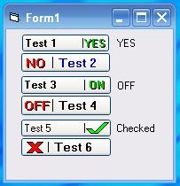



## Checkbox Style, XP Look\(update\)

### Description

Nothing special here. Just messing around. If you can use it,great.Its a checkbox style usercontrol with an XP look. The XP look code is not mine but looks really good.1.15.2009:Added disabled property.Made some minor changes.
 
### More Info
 

             |
---                |---
**Submitted On**   |2009-01-22 16:13:46
**By**             |[Kenneth Foster](https://github.com/Planet-Source-Code/PSCIndex/blob/master/ByAuthor/kenneth-foster.md)
**Level**          |Intermediate
**User Rating**    |5.0 (55 globes from 11 users)
**Compatibility**  |VB 6\.0
**Category**       |[Custom Controls/ Forms/  Menus](https://github.com/Planet-Source-Code/PSCIndex/blob/master/ByCategory/custom-controls-forms-menus__1-4.md)
**World**          |[Visual Basic](https://github.com/Planet-Source-Code/PSCIndex/blob/master/ByWorld/visual-basic.md)
**Archive File**   |[Checkbox\_S2141221222009\.zip](https://github.com/Planet-Source-Code/kenneth-foster-checkbox-style-xp-look-update__1-71590/archive/master.zip)

